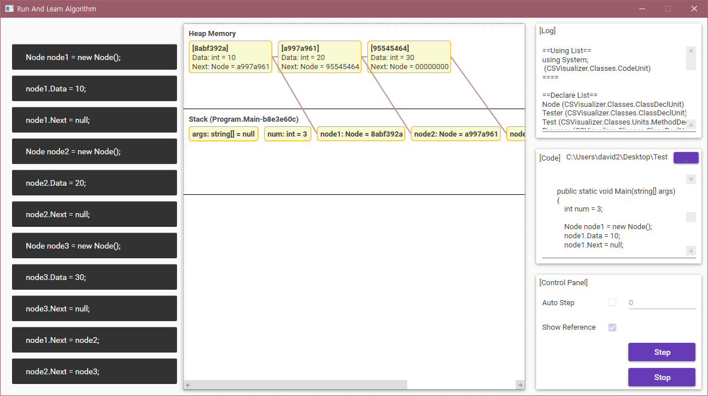
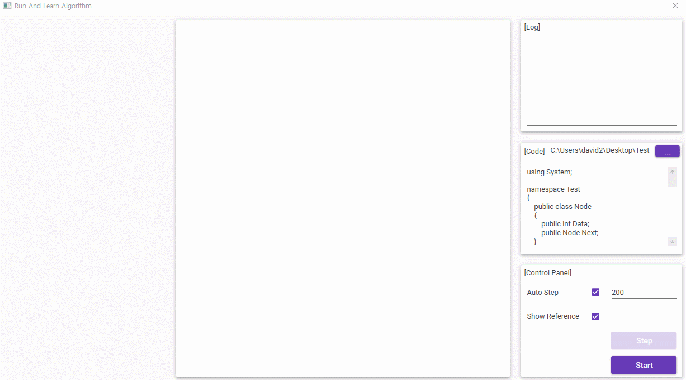

# RALA(Run And Learn your Algorithm)  
알고리즘을 실행하고 배우자!

### 사용 기술 및 알고리즘  
  
* Microsoft CodeAnalysis - 마이크로소프트 코드 분석기 ([GitHub](http://microsoft.github.io/CodeAnalysis/))
* Material Design In XAML - WPF Material 디자인 테마 ([Homepage](http://materialdesigninxaml.net/) / [GitHub](https://github.com/ButchersBoy/MaterialDesignInXamlToolkit))

### 언어 및 플랫폼  
  
* C#/WPF
* .NET Framework 4.6.1

### 기능 명세서  
* [pdf](docs/기능명세.pdf)  
* [docx](docs/기능명세.docx)  

### 스크린샷  
  

